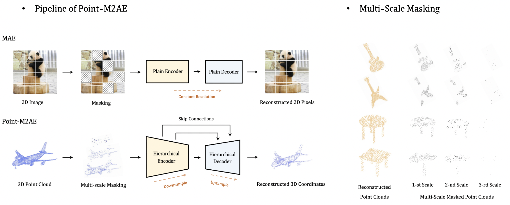

# Point-M2AE: Multi-scale Masked Autoencoders for Hierarchical Point Cloud Pre-training

[](https://paperswithcode.com/sota/3d-point-cloud-linear-classification-on?p=point-m2ae-multi-scale-masked-autoencoders)
[](https://paperswithcode.com/sota/3d-point-cloud-classification-on-scanobjectnn?p=point-m2ae-multi-scale-masked-autoencoders)
[](https://paperswithcode.com/sota/3d-point-cloud-classification-on-modelnet40?p=point-m2ae-multi-scale-masked-autoencoders)

Official implementation of ['Point-M2AE: Multi-scale Masked Autoencoders for Hierarchical Point Cloud Pre-training'](https://arxiv.org/pdf/2205.14401.pdf).

The paper has been accepted by **NeurIPS 2022** 🔥.

## News
* Our latest work, [I2P-MAE](https://arxiv.org/pdf/2212.06785.pdf) has been accepted by **CVPR 2023** 🔥 and [open-sourced](https://github.com/ZrrSkywalker/I2P-MAE). I2P-MAE leverges 2D pre-trained models to guide the pre-training of Point-M2AE and achieves *SOTA* performance on various 3D tasks.

## Introduction
Comparison with existing MAE-based models for self-supervised 3D point cloud learning on ModelNet40 dataset:
| Method | Parameters | GFlops| Extra Data | Linear SVM | Fine-tuning| Voting|
| :-----: | :-----: |:-----:| :-----: | :-----:| :-----:| :-----:|
| [Point-BERT](https://github.com/lulutang0608/Point-BERT) | 22.1M |4.8| -|87.4% | 92.7% | 93.2% | 
| [ACT](https://github.com/RunpeiDong/ACT) | 22.1M |4.8| 2D|- | - | 93.7% | 
| [Point-MAE](https://github.com/Pang-Yatian/Point-MAE) | 22.1M |4.8| -|91.0% | 93.2% | 93.8% | 
| **Point-M2AE** | **15.3M** |**3.6**| -|**92.9%** | **93.4%** | **94.0%** | 
| [I2P-MAE](https://github.com/ZrrSkywalker/I2P-MAE) | 15.3M |3.6| 2D|93.4% | 93.7% | 94.1% | 

Point-M2AE is a strong **M**ulti-scale **M**AE pre-training framework for hierarchical self-supervised learning of 3D point clouds. Unlike the standard transformer in MAE, we modify the encoder and decoder into pyramid architectures to progressively model spatial geometries and capture both fine-grained and high-level semantics of 3D shapes. We design a multi-scale masking strategy to generate consistent visible regions across scales, and reconstruct the masked coordinates from a global-to-local perspective.

<div align="center">
  
</div>

## Point-M2AE Models

### Pre-training
Pre-trained by ShapeNet, Point-M2AE is evaluated by **Linear SVM** on ModelNet40 and ScanObjectNN (OBJ-BG split) datasets, without downstream fine-tuning:
| Task | Dataset | Config | MN40 Acc.| OBJ-BG Acc.| Ckpts | Logs |   
| :-----: | :-----: |:-----:| :-----: | :-----:| :-----:|:-----:|
| Pre-training | ShapeNet |[point-m2ae.yaml](./cfgs/pre-training/point-m2ae.yaml)| 92.87% | 82.78% | [pre-train.pth](https://drive.google.com/file/d/1HyUEv04V2K6vMaR0P7WksuoiMtoXx1fM/view?usp=share_link) | [log](https://drive.google.com/file/d/1svx_CQ2x8dRDrf9C_jSDIXYYyJO8KG4m/view?usp=sharing) |

### Fine-tuning
After pre-training, we fine-tune Point-M2AE on three downstream tasks:

| Task | Dataset | Config | Acc.| Vote| Ckpts | Logs |   
| :-----: | :-----: |:-----:| :-----:| :-----: | :-----:|:-----:|
| Classification | ModelNet40 (1k)| [modelnet40.yaml](https://github.com/ZrrSkywalker/Point-M2AE/blob/main/cfgs/fine-tuning/modelnet40.yaml)|93.43%| 93.96% | - | - |


| Task | Dataset | Split | Config | Acc.| Ckpts | Logs |   
| :-----: | :-----: | :-----:|:-----:| :-----:| :-----:|:-----:|
| Classification | ScanObjectNN| [OBJ-BG](https://github.com/ZrrSkywalker/Point-M2AE/blob/main/cfgs/fine-tuning/scan_obj-bg.yaml) |-| 91.22%| - | - |
| Classification | ScanObjectNN| [OBJ-ONLY](https://github.com/ZrrSkywalker/Point-M2AE/blob/main/cfgs/fine-tuning/scan_obj.yaml) |-| 88.81%| - | - |
| Classification | ScanObjectNN| [PB-T50-RS](https://github.com/ZrrSkywalker/Point-M2AE/blob/main/cfgs/fine-tuning/scan_pb.yaml) |-| 86.43%| - | - |


| Task | Dataset | Config | Acc.| Vote| Ckpts | Logs |   
| :-----: | :-----: |:-----:| :-----:| :-----: | :-----:|:-----:|
| Segmentation | ShapeNetPart |-| 86.51% | -| - | - |


|  Task | Dataset | Config | 5w10s | 5w20s | 10w10s| 10w20s|     
| :-----: | :-----: |:-----:| :-----: | :-----:|:-----:|:-----:|
|  Few-shot Cls. | ModelNet40 |-| 96.8%|98.3%|92.3%|95.0%|


## Requirements

### Installation
Create a conda environment and install basic dependencies:
```bash
git clone https://github.com/ZrrSkywalker/Point-M2AE.git
cd Point-M2AE

conda create -n pointm2ae python=3.7
conda activate pointm2ae

pip install -r requirements.txt

# Install the according versions of torch and torchvision
conda install pytorch torchvision cudatoolkit
```
Install GPU-related packages:
```bash
# Chamfer Distance and EMD
cd ./extensions/chamfer_dist
python setup.py install --user
cd ../emd
python setup.py install --user

# PointNet++
pip install "git+https://github.com/erikwijmans/Pointnet2_PyTorch.git#egg=pointnet2_ops&subdirectory=pointnet2_ops_lib"

# GPU kNN
pip install --upgrade https://github.com/unlimblue/KNN_CUDA/releases/download/0.2/KNN_CUDA-0.2-py3-none-any.whl
```
### Datasets
For pre-training and fine-tuning, please follow [DATASET.md](https://github.com/lulutang0608/Point-BERT/blob/master/DATASET.md) to install ShapeNet, ModelNet40, ScanObjectNN, and ShapeNetPart datasets, referring to Point-BERT. Specially for Linear SVM evaluation, download the official [ModelNet40](https://shapenet.cs.stanford.edu/media/modelnet40_ply_hdf5_2048.zip) dataset and put the unzip folder under `data/`.

The final directory structure should be:
```
│Point-M2AE/
├──cfgs/
├──datasets/
├──data/
│   ├──ModelNet/
│   ├──ModelNetFewshot/
│   ├──modelnet40_ply_hdf5_2048/
│   ├──ScanObjectNN/
│   ├──ShapeNet55-34/
│   ├──shapenetcore_partanno_segmentation_benchmark_v0_normal/
├──...
```

## Get Started

### Pre-training
Point-M2AE is pre-trained on ShapeNet dataset with the config file `cfgs/pre-training/point-m2ae.yaml`. Run:
```bash
CUDA_VISIBLE_DEVICES=0 python main.py --config cfgs/pre-training/point-m2ae.yaml --exp_name pre-train
```

To evaluate the pre-trained Point-M2AE by **Linear SVM on ModelNet40**, create the folder `ckpts/` and download the [ckpt-best.pth](https://drive.google.com/file/d/1mkfoGSp01th9Pctlk_mE0o-5sOb3vQpD/view?usp=sharing) into it. You will get 92.87% by running:
```bash
CUDA_VISIBLE_DEVICES=0 python main.py --config cfgs/pre-training/point-m2ae.yaml --exp_name test_svm --test_svm modelnet40 --ckpts ./ckpts/ckpt-best.pth
```
### Fine-tuning
Coming in a few days.

## Acknowledgement
This repo benefits from [Point-BERT](https://github.com/lulutang0608/Point-BERT) and [Point-MAE](https://github.com/Pang-Yatian/Point-MAE). Thanks for their wonderful works.

## Citation
```bash
@article{zhang2022point,
  title={Point-M2AE: Multi-scale Masked Autoencoders for Hierarchical Point Cloud Pre-training},
  author={Zhang, Renrui and Guo, Ziyu and Gao, Peng and Fang, Rongyao and Zhao, Bin and Wang, Dong and Qiao, Yu and Li, Hongsheng},
  journal={arXiv preprint arXiv:2205.14401},
  year={2022}
}
```

## Contact
If you have any question about this project, please feel free to contact zhangrenrui@pjlab.org.cn.
